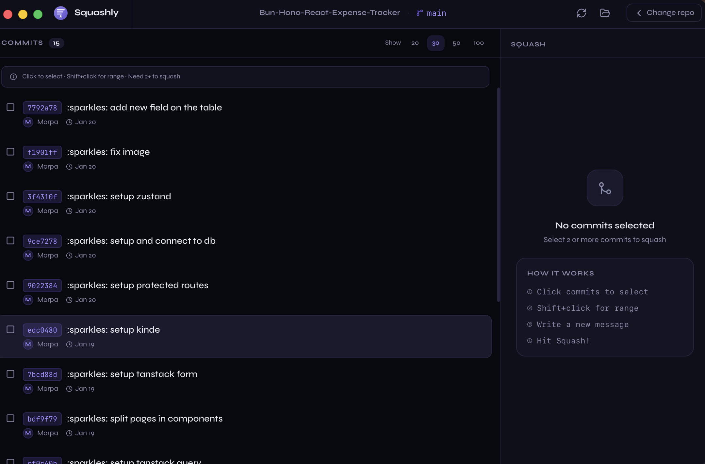

# 🟣 Squashly

> Git commit squasher — seleciona, combina, simplifica.



Squashly é uma app desktop nativa construída com **Wails v2 + React + Tailwind v4** que te permite fazer squash de commits git de forma visual e intuitiva, sem precisar de memorizar comandos de rebase interativo.

---

## ✨ Features

- 📋 **Lista de commits** visual com seleção individual ou por range (Shift+click)
- ✏️ **Editor de mensagem** com suporte a body opcional
- 🔍 **Preview** do squash antes de confirmar — vê exatamente o que vai acontecer
- 🌿 **Branch awareness** — mostra o branch atual e estado do repositório
- 🔔 **Toasts** de feedback em tempo real
- 🗂️ **Limites configuráveis** — mostra 20, 30, 50 ou 100 commits
- 🔄 **Refresh** rápido após o squash
- 🖥️ **Titlebar nativa** com drag region no macOS

---

## 🛠 Stack

| Camada | Tecnologia |
|---|---|
| Desktop runtime | [Wails v2](https://wails.io) |
| UI framework | React 18 |
| Styling | Tailwind CSS v4 |
| Linguagem backend | Go 1.22 |
| Build tool | Vite 6 |
| Fontes | Syne + JetBrains Mono |

---

## 🚀 Getting Started

### Pré-requisitos

- [Go 1.22+](https://go.dev/dl/)
- [Node.js 18+](https://nodejs.org)
- [Wails CLI](https://wails.io/docs/gettingstarted/installation)

```bash
go install github.com/wailsapp/wails/v2/cmd/wails@latest
```

### Desenvolvimento

```bash
# Clone o repo
git clone https://github.com/you/squashly
cd squashly

# Instalar dependências frontend
cd frontend && npm install && cd ..

# Correr em modo dev (hot reload)
wails dev
```

### Build para produção

```bash
# macOS
wails build -platform darwin/universal

# Windows
wails build -platform windows/amd64

# Linux
wails build -platform linux/amd64
```

O binário estará em `./build/bin/`.

---

## 📁 Estrutura do Projeto

```
squashly/
├── main.go                    # Entry point Wails
├── wails.json                 # Configuração Wails
├── go.mod
├── internal/
│   ├── app/
│   │   ├── app.go             # App struct + lifecycle hooks
│   │   ├── methods.go         # Métodos expostos ao frontend
│   │   └── dialog.go         # Diálogo nativo de pasta
│   └── git/
│       ├── models.go          # Types: Commit, Branch, RepoInfo, etc.
│       └── service.go         # Toda a lógica git (exec.Command)
└── frontend/
    ├── src/
    │   ├── main.tsx
    │   ├── App.tsx
    │   ├── index.css           # Tailwind v4 + CSS variables
    │   ├── lib/
    │   │   ├── wails.ts        # Bindings + tipos + mock para dev
    │   │   └── utils.ts        # Helpers (formatDate, cn, etc.)
    │   ├── hooks/
    │   │   └── useAppStore.ts  # Estado global da app
    │   └── components/
    │       ├── SquashlyLogo.tsx
    │       ├── WelcomeScreen.tsx
    │       ├── MainView.tsx
    │       ├── Titlebar.tsx
    │       ├── CommitList.tsx
    │       ├── SquashPanel.tsx
    │       └── ToastSystem.tsx
    ├── package.json
    ├── vite.config.ts
    └── tsconfig.json
```

---

## 🔧 Como o Squash funciona

O squash usa `git reset --soft` em vez de rebase interativo, o que é mais simples e seguro:

1. Encontra o commit **pai** do commit mais antigo selecionado
2. Faz `git reset --soft <pai>` — move o HEAD sem alterar o working tree
3. Faz `git commit -m "<mensagem>"` — cria um commit novo com todas as mudanças

> ⚠️ **Atenção**: Tal como qualquer squash, isto reescreve a história do Git. Não uses em branches partilhados sem coordenar com a tua equipa.

---

## 🎨 Design

- **Tema**: Dark, roxo/violeta como cor de acento
- **Fontes**: Syne (UI) + JetBrains Mono (código/hashes)
- **Estética**: Terminal-meets-modern — preciso, denso, mas limpo

---